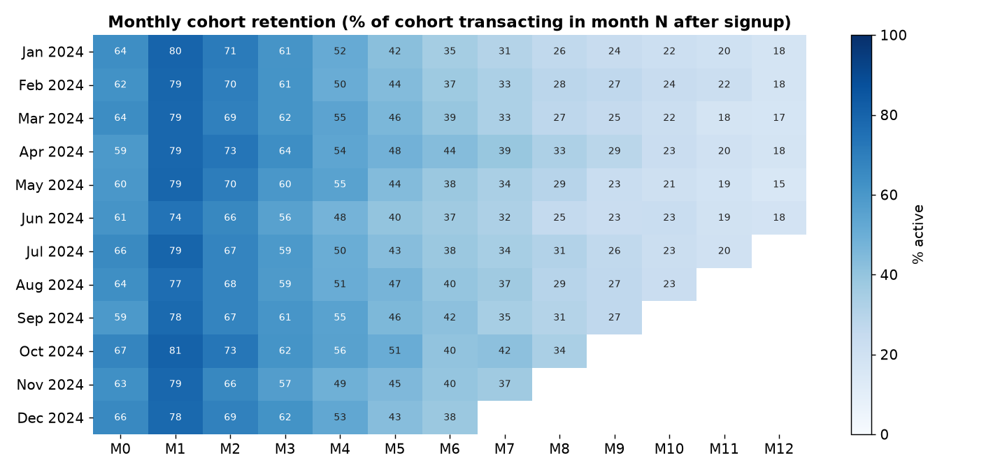
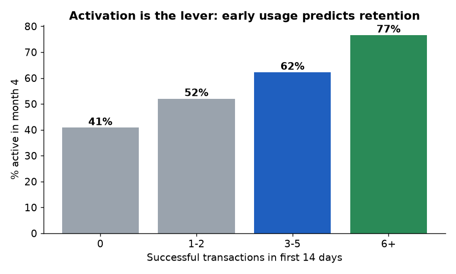

# Wallet Churn & Retention - a data story

**Business question:** *Why do wallet customers go quiet, and what should Growth do about it?*
**Full narrative with charts: [`REPORT.md`](REPORT.md)**

## Headlines
- Retention drops from **78% (month 1) -> 60% (month 3) -> 39% (month 6)**.
- **Organic** customers retain 1.4x better than **paid_social** by month 6 - judge channels on cost per *retained* customer.
- Customers who make 6+ transactions in their first 14 days are **1.9x** more likely to still be active in month 4 -> build an activation journey (and A/B test it).
- The top 10% of customers drive 42% of volume; KYC tier-1 customers churn fastest (79% vs 58% for tier 3).




## Storytelling choices
One chart = one message. Colour is used only to highlight the point (best/worst channel, top activation buckets); titles state the takeaway rather than the metric; the report ends in ranked, actionable recommendations and an explicit **correlation-vs-causation** caveat.

## Skills shown
Cohort analysis, retention curves, activation analysis, customer value concentration, SQL (DuckDB: CTEs, `date_trunc`, `date_diff`, joins on time windows), matplotlib, business recommendations.

## Reproduce
```bash
pip install -r requirements.txt
python src/gen_data.py --out data/raw
python src/analysis.py      # regenerates figures/ and REPORT.md
```
Synthetic, seeded data - no real customers.
