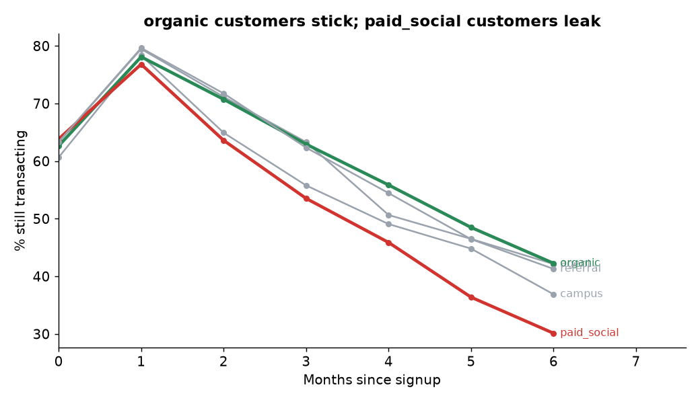

# Wallet churn & retention - the story

**Business question:** *Why do wallet customers go quiet, and what should Growth do about it?*
**Data:** 5,000 customers, signups Jan 2024 - Mar 2025 (synthetic).

## 1. The shape of the problem
Average retention across 2024 cohorts is **78% in month 1, 60% in month 3 and 39% in month 6**.

## 2. Not all acquisition channels are equal
By month 6 the best channel (**organic**, 42%) retains **1.4x** as many customers as the worst (**paid_social**, 30%).

## 3. Activation is the lever
| Txns in first 14 days | Customers | Active in month 4 |
|---|---|---|
| 0 | 1,259 | 41% |
| 1-2 | 1,683 | 52% |
| 3-5 | 832 | 62% |
| 6+ | 261 | 77% |

Customers with 6+ early transactions are **1.9x** as likely to be active in month 4 as customers with none.

## 4. Who matters
The top 10% of customers by value drive **42%** of transaction volume. KYC tier 1 customers churn at **79%** vs **58%** for tier 3.

## Recommendations
1. **Re-weight acquisition spend** away from paid_social toward organic; compare CAC *per retained customer*, not per signup.
2. **Build an activation journey:** nudge every new customer to 3+ transactions in 14 days (airtime top-up, first bill payment, cashback on first POS spend).
3. **Reduce KYC tier-1 friction/limits** with an upgrade prompt - this segment churns fastest.
4. **Protect the top decile** with proactive service and rewards; losing a few of them moves volume more than the long tail.

## Caveats
The activation link is a **correlation** - engaged customers transact early *and* stay - so the recommended nudge should be validated with an A/B test before scaling. Synthetic data with built-in effects; "churn" here = no activity after `churn_date`. In production, define churn as N days of inactivity and run this as a scheduled model (see my dbt repo).
